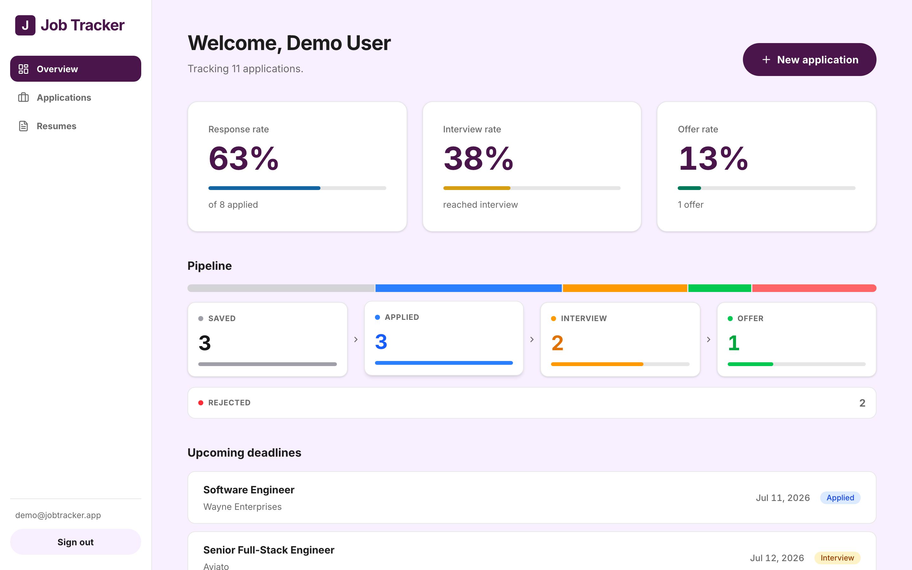
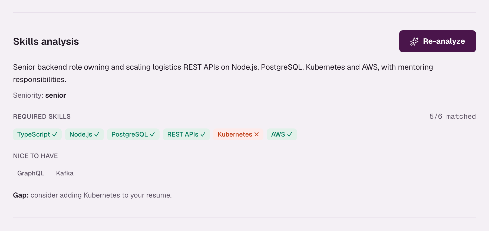
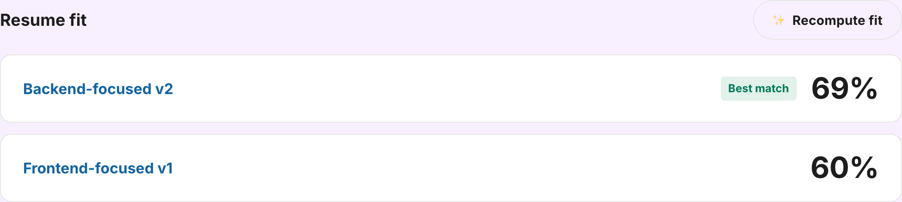
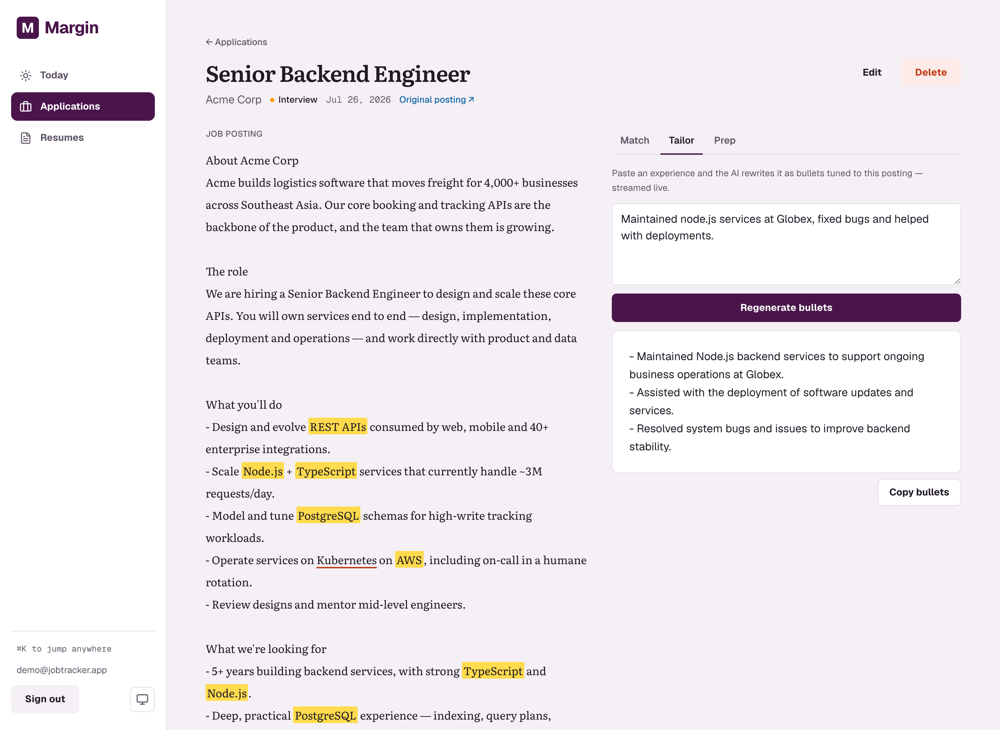

<div align="center">

# 💼 Job Tracker

**A smart job-application tracker that uses AI to analyze job descriptions and tailor your resume — built to manage a real job hunt instead of a spreadsheet.**

[](https://github.com/nkieu-config/job-tracker-app-project/actions/workflows/ci.yml)
[](https://job-tracker-app-project.vercel.app)
[](LICENSE)


**[Open the live demo →](https://job-tracker-app-project.vercel.app)**

Click **“Try Live Demo”** on the homepage or sign-up page — or manually use
`demo@jobtracker.app` / `demotracker2026` — for a pre-populated dashboard.

</div>

---

## 📸 Screenshots

<div align="center">

**Dashboard — applications by status & upcoming deadlines**



<br />

**AI job-description analysis + skill gap**



</div>

| Resume fit ranking (pgvector) | Bullet tailoring (streamed live) |
| :---: | :---: |
|  |  |

## ✨ Features

- **Beautiful & Responsive UI** — styled with a modern 'Slacc' aesthetic using strict semantic design tokens, fully optimized for mobile devices.
- **Auth & accounts** — email/password sign up / sign in; every piece of data is scoped to the signed-in user.
- **Application tracker** — full CRUD for applications with status (Saved → Applied → Interview → Offer → Rejected), deadlines, notes, and a dashboard that counts by status and surfaces upcoming deadlines.
- **Resume versions** — upload PDF resumes; text is extracted and stored for the AI features.
- **AI · JD analysis + skill gap** — Gemini extracts required skills, nice-to-haves, seniority, and a summary from a job description, then highlights which required skills are missing from your resume.
- **AI · resume fit score** — embeds the JD and your resumes and ranks each resume version by cosine similarity using **pgvector**.
- **AI · bullet tailoring (streaming)** — rewrites your experience into resume bullets tuned to the JD, streamed token-by-token.

## 🧱 Tech stack

| Layer | Choice |
| --- | --- |
| Framework | Next.js 16 (App Router, Server Actions) + TypeScript |
| AI service | Express (internal microservice) |
| UI | Tailwind CSS v4 |
| Database | PostgreSQL (Neon) + Prisma 7 (driver adapter) + pgvector |
| Auth | Better Auth (sessions in Postgres) |
| File storage | Vercel Blob (private) |
| AI | Google Gemini 2.5 Flash (generation) + `gemini-embedding-001` (embeddings) |
| Validation | Zod |
| Testing / CI | Vitest + Testing Library, GitHub Actions |
| Monorepo | npm workspaces + Turborepo |
| Hosting | Vercel (web) + Railway/Render (AI service) |

## 📁 Project structure

```
job-tracker/
├── apps/
│   ├── web/                 # @job-tracker/web — Next.js 16
│   │   ├── src/
│   │   │   ├── app/         # App Router (routes)
│   │   │   ├── components/  # UI by domain (auth, applications, resumes…)
│   │   │   ├── actions/     # Server Actions
│   │   │   ├── lib/         # Server utilities (auth, data, AI client)
│   │   │   └── generated/   # Prisma client (generated)
│   │   ├── tests/
│   │   └── package.json
│   └── ai-service/          # @job-tracker/ai-service — Express
├── packages/
│   ├── db/                  # Prisma schema + migrations
│   └── shared/              # Zod schemas, AiError, shared constants
├── docs/
├── scripts/
├── turbo.json
└── package.json             # Workspace root (orchestration only)
```

## 🏗️ Architecture

```
Browser
   │
   ▼
Next.js (web) ── auth, CRUD, file upload, pgvector queries
   │                    │
   │                    ▼
   │              Postgres + Vercel Blob
   │
   │  internal HTTP (x-internal-key)
   ▼
Express (ai-service) ── Gemini API only
```

- **Next.js = BFF.** Handles UI, sessions, database, and rate limiting. Calls the AI service over internal HTTP — never exposes `GEMINI_API_KEY` to the web app.
- **Express = stateless AI worker.** Three endpoints: `/analyze`, `/embed`, `/tailor` (streaming). No database access; receives text, returns JSON or a stream.
- **Shared Zod schemas** in `packages/shared/` keep JD analysis types in sync across both apps.

## 🏗️ Architecture notes

- **Defense-in-depth auth.** A `proxy.ts` (Next 16's renamed middleware) does an optimistic cookie check, but every page, Server Action, and route handler independently re-checks the session and scopes queries by `userId` — middleware is never the only gate (see CVE-2025-29927).
- **Two-layer AI validation.** The JSON schema Gemini must follow is derived from a Zod schema (`z.toJSONSchema`), and the response is re-validated with that same schema, so malformed model output never reaches the UI.
- **pgvector via raw SQL.** Vector columns are declared `Unsupported("vector(768)")` so Prisma tracks them without drift; embeddings are written and ranked with raw SQL (`<=>` cosine operator, HNSW index).
- **Per-request data efficiency.** The session lookup is memoized with `React.cache` (one Better Auth call per request, not one per layout + page), and independent reads on a page are fetched together with `Promise.all` instead of waterfalling.

## ⚙️ Local setup

```bash
# 1. Install deps (workspaces + postinstall runs prisma generate)
npm install

# 2. Configure environment
cp apps/web/.env.example apps/web/.env
cp apps/ai-service/.env.example apps/ai-service/.env
# Set INTERNAL_API_KEY to the same value in both files

# 3. Apply migrations to your database
npx prisma migrate dev

# 4. Run (two terminals)
npm run dev:ai           # http://localhost:4000
npm run dev              # http://localhost:3000
```

### Environment variables

See [apps/web/.env.example](apps/web/.env.example) and [apps/ai-service/.env.example](apps/ai-service/.env.example). `.env` files are gitignored.

- `DATABASE_URL` — Neon Postgres connection string (pooled connection is supported and recommended via the Neon Serverless driver).
- `BETTER_AUTH_SECRET` — random secret (`openssl rand -base64 32`).
- `BETTER_AUTH_URL` — `http://localhost:3000` locally; your deployment URL in prod.
- `BLOB_READ_WRITE_TOKEN` — from a Vercel Blob store (`vercel env pull`).
- `AI_SERVICE_URL` — `http://localhost:4000` locally; your AI service URL in prod.
- `INTERNAL_API_KEY` — shared secret between web and AI service (`openssl rand -base64 32`).

AI service env (`apps/ai-service/.env`): `GEMINI_API_KEY`, `INTERNAL_API_KEY` (same value), `PORT`.

### Scripts

```bash
npm run dev         # Next.js dev server
npm run dev:ai      # Express AI microservice
npm run build       # production build
npm run build:ai    # build AI service
npm run lint        # eslint
npm run typecheck   # web app only
npm run check       # turbo: typecheck all workspaces
npm test            # vitest
npm run seed        # populate the demo account (server must be running)
```

To verify a running deployment by hand, follow [docs/manual-qa.md](docs/manual-qa.md).

### Demo account

`npm run seed` creates `demo@jobtracker.app` / `demotracker2026` with sample
applications, multiple resumes, and various high-fit/low-fit pre-computed JD
analyses so the live demo fully showcases the AI features. Start the server first (`npm run start &`), then run the seed.

## 🚀 Deploy (GitHub → Vercel → Render → Neon)

Full step-by-step: **[docs/deploy.md](docs/deploy.md)**

1. **Neon** — Postgres; copy pooled + direct connection strings.
2. **Vercel Blob** — create a Blob store for resume PDFs.
3. **GitHub** — push the monorepo (includes `render.yaml`).
4. **Render** — New → Blueprint → connect repo; set `GEMINI_API_KEY` + `INTERNAL_API_KEY` on `job-tracker-ai-service`.
5. **Vercel** — Root Directory `apps/web`; env: `AI_SERVICE_URL` (Render URL), `INTERNAL_API_KEY`, `BETTER_AUTH_URL`, DB, Blob. No `GEMINI_API_KEY` on web.
6. **Migrations** — `npx prisma migrate deploy`.

Quick helper after Render is live:

```bash
./scripts/set-ai-service-url.sh https://job-tracker-ai-service.onrender.com
```

## 🧩 Challenges & solutions

- **Prisma 7 dropped the bundled query engine.** Schema and client live in `packages/db/`; migrations run from the repo root via `prisma.config.ts`.
- **Database Connection Pooling in Serverless.** To prevent connection exhaustion from Next.js Serverless functions, the app uses `@neondatabase/serverless` and `@prisma/adapter-neon`. This enables robust connection pooling over HTTP/WebSocket natively, resolving prior TLS/SNI routing issues encountered with the standard `pg` driver.
- **Better Auth pulled a broken kysely.** kysely `0.29.2` stopped re-exporting a symbol the adapter imports; pinned to `0.28.17` via an npm `override`.
- **Next 16 renamed `middleware` → `proxy`.** Read the bundled Next docs and used the new `proxy.ts` convention (which also reinforces the data-layer auth checks above).
- **Trusting AI output.** Gemini occasionally returns off-schema JSON; the Zod round-trip (schema-out, validate-in) makes the failure explicit and recoverable instead of crashing the page.
- **Private resumes.** Resume PDFs are stored in a private Blob and streamed only through an authenticated, ownership-scoped route — the blob URL is never public.

## 📄 License

[MIT](LICENSE) © 2026 Natthachak
